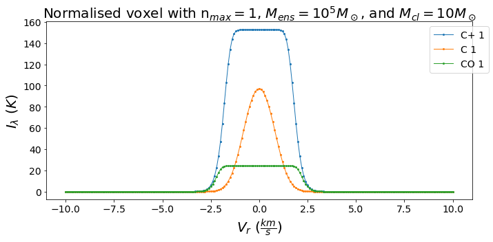
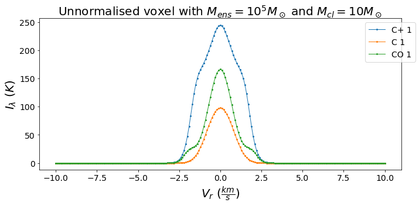
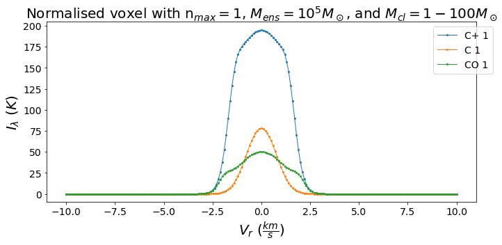
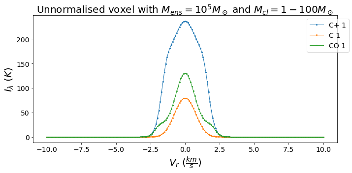
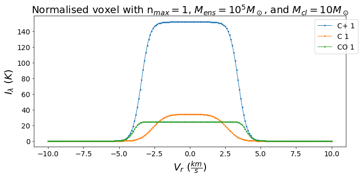
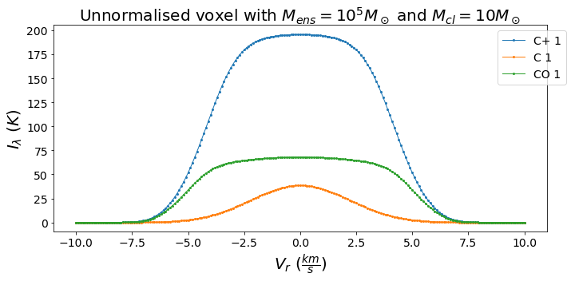
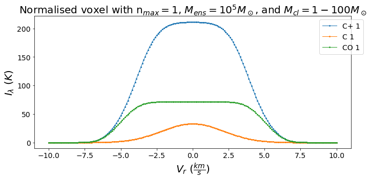
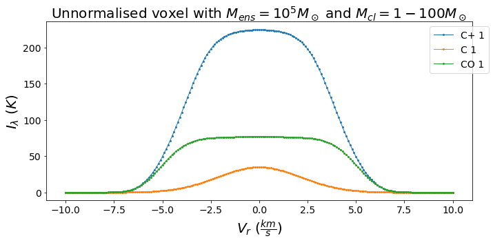

## The issue

There appears to be some discrepancy between the intensities obtained with the single-voxel model depending on its normalisation. This is parameterised using $n_{max}$. Let me start with the known solution for a dense voxel with just one clump mass. We will not consider an ensemble velocity dispersion in this example. This had the flat saturation feature as expected (we can only "see" a ccertain distance into the voxel). This saturation feature in obtainable by setting $n_{max} \sim 1$, as seen below. 

Similar plots can be obtained if we increase $n_{max}$. This should be compared to the unnormalised result to ensure it is correct. After all, this normalisation is merely a method of reducing the execution time and memory footprint. The unnormalised result, however, is rather strange... It has the confusing *gassian-over-saturation* features I complained about a few weeks ago.

Now I will compare this to the result with 3 clump masses. Both the normalised and unnormalised voxels have this *gaussian-over-saturation* feature when there is no ensemble velocity dispersion.

## Considering ensemble velocity dispersion

While the previous examples without velocity dispersion should still be valid, and physical PDR will have $\sigma_{ens} > 0$. Considering this changes the intensity plot slightly. For just one clump mass, the unnormalised voxel is still not quite saturated. Conversely, the normalised voxel needs to have $n_{max} > 1$ to accurately model the ensemble.

Performing the same steps using multiple clump masses, we also get different results (or rather the same). The normalised and unnormalised plots appear to agree, and there is just a slight curvature to the plateau of the unnormalised voxel.

## Conclusion

I believe the issue arises from the $n_{max}$ I consider. Since these are voxels that contain many clumps, I should not normalise the largest clump to $1$ but some larger integer.

I would be more confident in saying that is the issue if the unnormalised voxel with one clump mass had a flat saturation feature. Since it is not flat, I think there might be some sort of machine precision error. I tested for such an error by changing to a larger data type, but there was no observed difference.

For now, the next steps I have planned is a systematic analysis of the effect of changing $n_{max}$, both for a dense clump and a diffuse clump. I am hoping that I can implement some routine to choose the best value of $n_{max}$ in the code rather than as an argument to the setup. To do that, I will need to create some models to quantify the error in normalisation.
